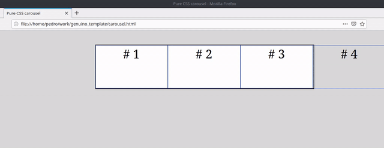

# pure-css-carousel

> Html carousel using pure css animations, no javascript

Carrusel para sitios web, sin javascript, usando solamente animaciones CSS.

Aquí el propósito es tener una animación de carrusel en páginas HTML pero evitando scripts para lograr una carga más ligera.

Para lograrlo se utiliza una combinación entre `maquetación y animaciones css`, en primer lugar el área de despliegue de elementos del carrusel, llamada carousel-container, debe tener un tamaño de forma que su anchura sea menor o igual a la suma de anchura de los elementos menos uno.

El elemento restante se puede ocultar usando la propiedad overflow: hidden.

La `primera animación` css se encarga de `deslizar los elementos de derecha a izquierda`, siendo este el efecto de carrusel.

La `segunda animación`, y muy importante es `cambiar el primer elemento desde el inicio hacia el final de elementos`, de esta forma obtenemos el efecto de continuidad en un ciclo permanente.

Para lograr lo anterior usando solo css, utilizamos la propiedad `order`, del despliegue tipo `flex`, haciendo que cada vez que terminan de dezlisarce todos los elementos se cambie el orden para asi recorrerlos un "paso" adelante y el que era el primero hasta el final.

Para lograr lo anterior es importante hacer el cambio de `order` para todos los elementos, y hacerlo de forma que cada tiempo de la animación asigne un nuevo valor de `order` hasta que todos recorran todas las posiciones y entonces repetir de nuevo las posiciones.

De lo anterior se deduce que entre más elementos más tiempos serán necesarios y la animación será un poco más compleja.

Finalmente, para que esto funcione y el efecto se vea convincente ambas animaciones deben estar sincronizadas en sus respectivos tiempos.
